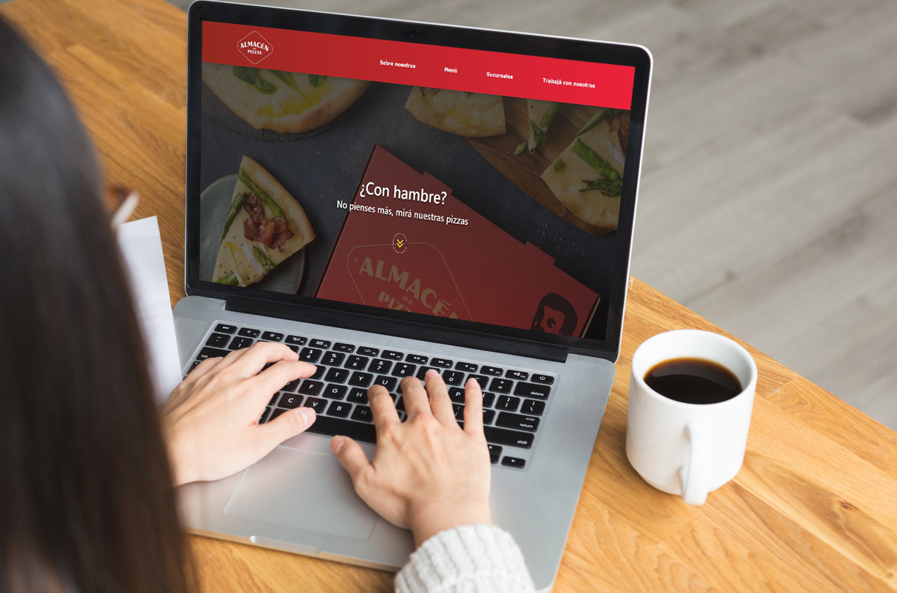

# Pizzeria - Coderhouse
He creado esta web para el proyecto final del curso de Diseño Web de Coderhouse. La misma está creada principalmente con HTML, CSS y algunos componentes de Bootstrap, además de tener algunos scripts de JavaScript.

## Índice

- [Overview](#overview)
  - [Screenshot](#screenshot)
  - [Links](#links)
- [Mi proceso](#mi-proceso)
  - [Construido con](#construido-con)
- [Autor](#autor)

## Overview

### Screenshot

### Links

- [URL del Sitio Web](https://sgrinblat.github.io/Pizzeria__Coderhouse/)

## Mi proceso

### Construido con

- JavaScript
- CSS
- Bootstrap

## Autor

- Linkedin - [Santiago Grinblat](https://www.linkedin.com/in/santiago-grinblat/)
